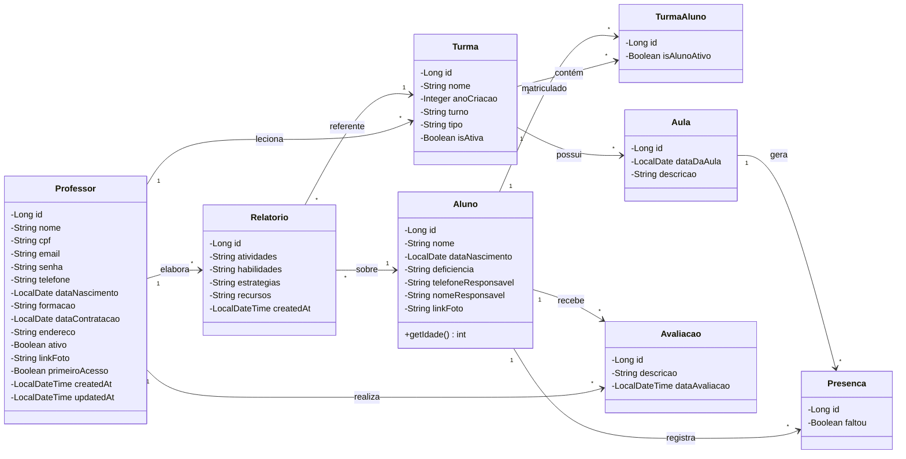
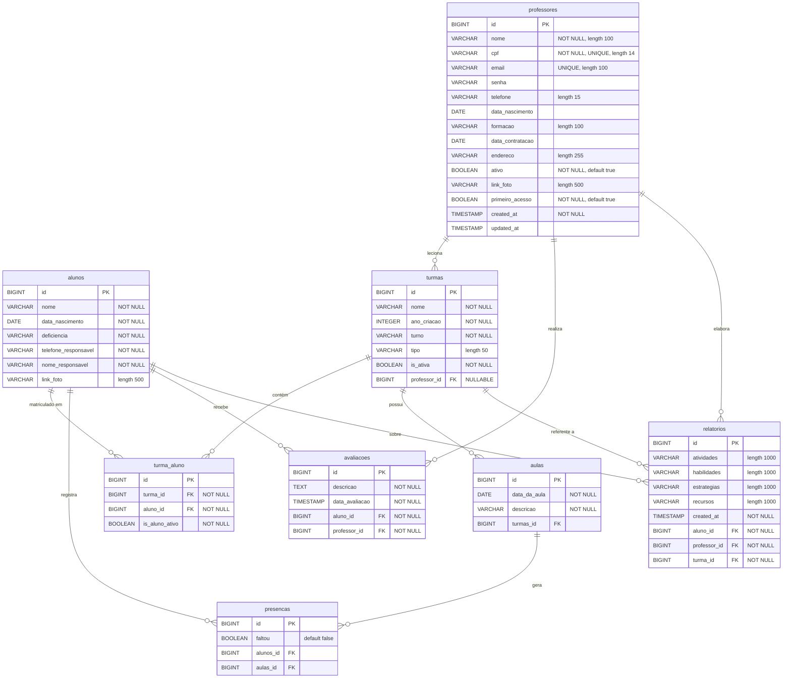

<div align="center">
  
  
  <h1>APAE Gestão Escolar</h1>
  
  <p>
    <strong>Sistema completo para gestão escolar da APAE</strong>
  </p>

  <p>
    
    
    
    
    
    
    
  </p>

  <br />

  <a href="https://github.com/IFPBEsp/APAE-gestao-escolar/commits/main">
    
  </a>
  <a href="https://github.com/IFPBEsp/APAE-gestao-escolar/issues">
    
  </a>
  <a href="https://github.com/IFPBEsp/APAE-gestao-escolar/blob/main/LICENSE">
    
  </a>
</div>

<br />

## Sumário

- [Sobre o Projeto](#-sobre-o-projeto)
- [Stack Tecnológica](#-stack-tecnológica)
- [Estrutura do Projeto](#-estrutura-do-projeto)
- [Quick Start](#-quick-start)
- [Infraestrutura e Deploy](#-infraestrutura-e-deploy)
- [Deploy com Docker e GHCR](#-deploy-com-docker-e-ghcr)
- [Diagrama de Classes](#-diagrama-de-classes)
- [Modelo Entidade-Relacionamento](#-modelo-entidade-relacionamento-er)
- [Referência da API](#-referência-da-api)
- [Códigos de Status HTTP](#-códigos-de-status-http)
- [Padrão de Documentação Swagger/OpenAPI](#-padrão-de-documentação-swaggeropenapi)
- [Git Flow](#-git-flow)
- [Style Guide](#-style-guide)
- [Conventional Commits](#-conventional-commits)
- [Como Contribuir](#-como-contribuir)

---

## Sobre o Projeto

A **APAE (Associação de Pais e Amigos dos Excepcionais)** é uma das maiores redes de atenção à pessoa com deficiência no Brasil. Este sistema foi desenvolvido para **otimizar a gestão escolar da APAE**, oferecendo uma plataforma unificada para controle administrativo e pedagógico.

O objetivo é **substituir processos manuais e fragmentados** por uma ferramenta digital que melhore a organização, acessibilidade e eficiência dos processos diários da instituição — impactando diretamente a qualidade do atendimento aos alunos com deficiência.

### Funcionalidades Principais

- **Gestão de Alunos** — cadastro, matrícula em turmas, histórico escolar e controle de frequência.
- **Gestão de Professores** — cadastro, vinculação a turmas, ativação/inativação e primeiro acesso.
- **Gestão de Turmas** — criação, atribuição de professores, gerenciamento de alunos ativos/inativos.
- **Chamada e Frequência** — registro de presenças/faltas por aula, resumo de frequência por turma e aluno.
- **Avaliações e Relatórios** — registro pedagógico do desenvolvimento de cada aluno.
- **Painel Administrativo** — gerenciamento de permissões e acessos com papéis `ADMIN` e `TEACHER`.
- **Interface Responsiva** — UI acessível para diferentes dispositivos.

### Acesso à Produção

| Ambiente | URL |
|----------|-----|
| **Frontend** | [https://apae-gestao-escolar.vercel.app/](https://apae-gestao-escolar.vercel.app/) |
| **Backend** | [https://apae-gestao-escolar.onrender.com/](https://apae-gestao-escolar.onrender.com/) |
| **Swagger (API Docs)** | [https://apae-gestao-escolar.onrender.com/docs](https://apae-gestao-escolar.onrender.com/docs) |

> O backend no Render (free tier) pode levar alguns segundos para iniciar em caso de inatividade.

---

## Stack Tecnológica

### Frontend

| Tecnologia | Versão | Descrição |
|------------|--------|-----------|
| [Next.js](https://nextjs.org/) | 16.x | Framework React com App Router e SSR |
| [React](https://reactjs.org/) | 18.x | Biblioteca para interfaces de usuário |
| [TypeScript](https://www.typescriptlang.org/) | 5.4 | Superset JavaScript com tipagem estática |
| [Tailwind CSS](https://tailwindcss.com/) | 3.4 | Framework de CSS utilitário |
| [Radix UI](https://www.radix-ui.com/) | — | Primitivos de UI acessíveis (via shadcn/ui) |
| [Axios](https://axios-http.com/) | 1.7 | Cliente HTTP para comunicação com a API |
| [Lucide React](https://lucide.dev/) | — | Biblioteca de ícones |
| [ESLint](https://eslint.org/) + [Prettier](https://prettier.io/) | — | Padronização e formatação de código |

### Backend

| Tecnologia | Versão | Descrição |
|------------|--------|-----------|
| [Spring Boot](https://spring.io/projects/spring-boot) | 3.3.2 | Framework Java para APIs REST |
| [Java](https://adoptium.net/) | 21 | Linguagem de programação do backend |
| [Spring Security](https://spring.io/projects/spring-security) | — | Autenticação e autorização (JWT) |
| [Spring Data JPA](https://spring.io/projects/spring-data-jpa) | — | Persistência e acesso a dados |
| [Flyway](https://flywaydb.org/) | 9.22 | Versionamento e migração do banco de dados |
| [Springdoc OpenAPI](https://springdoc.org/) | 2.5 | Documentação automática da API (Swagger UI) |
| [MinIO](https://min.io/) | 8.5 | Armazenamento de objetos (fotos) |
| [Lombok](https://projectlombok.org/) | — | Redução de boilerplate Java |

### Infraestrutura e Deploy

| Tecnologia | Descrição |
|------------|-----------|
| [Docker](https://www.docker.com/) | Containerização do PostgreSQL e MinIO (desenvolvimento) |
| [PostgreSQL](https://www.postgresql.org/) | Banco de dados relacional (v13 local, Neon em produção) |
| [Neon](https://neon.tech/) | PostgreSQL serverless (produção) |
| [Vercel](https://vercel.com/) | Deploy do frontend |
| [Render](https://render.com/) | Deploy do backend |

### Ferramentas

| Tecnologia | Descrição |
|------------|-----------|
| [Git](https://git-scm.com/) | Controle de versão |
| [VS Code](https://code.visualstudio.com/) / [IntelliJ IDEA](https://www.jetbrains.com/idea/) | Editores recomendados |

---

## Estrutura do Projeto

```
APAE-gestao-escolar/
├── .env.example                  # Variáveis de ambiente (backend)
├── .github/
│   ├── ISSUE_TEMPLATE/           # Templates de issues
│   └── pull_request_template.md  # Template de PR
├── api/                          # Backend — Spring Boot (Java 21)
│   ├── Dockerfile                # Imagem Docker do backend
│   ├── docker-compose.yml        # PostgreSQL + MinIO (desenvolvimento)
│   ├── pom.xml                   # Dependências Maven
│   ├── mvnw / mvnw.cmd           # Maven Wrapper (Linux/Windows)
│   └── src/
│       ├── main/
│       │   ├── java/com/apae/gestao/
│       │   │   ├── config/       # Segurança, OpenAPI, MinIO
│       │   │   ├── controller/   # Endpoints REST
│       │   │   ├── dto/          # Data Transfer Objects
│       │   │   ├── entity/       # Entidades JPA
│       │   │   ├── exception/    # Tratamento global de erros
│       │   │   ├── repository/   # Repositórios Spring Data
│       │   │   ├── security/     # Filtro JWT
│       │   │   └── service/      # Lógica de negócio
│       │   └── resources/
│       │       ├── application.properties
│       │       └── db/migration/ # Scripts Flyway
│       └── test/                 # Testes
├── app/                          # Frontend — Next.js (TypeScript)
│   ├── next.config.js            # Proxy de API em desenvolvimento
│   ├── tailwind.config.js        # Configuração Tailwind + shadcn/ui
│   ├── tsconfig.json             # Aliases de importação (@/*)
│   ├── package.json              # Dependências npm
│   └── src/
│       ├── app/                  # Páginas e rotas (App Router)
│       │   ├── admin/            # Painel administrativo
│       │   ├── professor/        # Painel do professor
│       │   ├── login/            # Página de login
│       │   └── primeiro-acesso/  # Primeiro acesso do professor
│       ├── components/           # Componentes reutilizáveis (shadcn/ui)
│       ├── contexts/             # AuthContext (React Context)
│       ├── services/             # Camada de comunicação com API (Axios)
│       ├── styles/               # Estilos globais (globals.css)
│       ├── types/                # Tipos TypeScript
│       └── utils/                # Funções auxiliares
└── docs/                         # Documentação auxiliar
    ├── funcoes.md                # Funções PostgreSQL otimizadas
    └── ModeloConceitualRefactor.png
```

---

## Quick Start

### Desenvolvimento local autonomo

O Gestao Escolar pode ser executado sem iniciar o APAE-Geral ou o Atendimento.
O PostgreSQL local reproduz os tres schemas do Neon:

- `gestao_escolar`: schema real do produto, versionado pelas migrations Flyway V1-V6;
- `apae_geral`: contrato minimo mockado com usuarios, enderecos, pacientes e responsaveis;
- `atendimento`: schema presente, mas vazio, pois o Gestao Escolar nao o consulta.

Na raiz do repositorio:

```bash
cp .env.example .env
npm --prefix app install
npm run db:prepare
npm run dev
```

Servicos locais:

- Frontend: `http://localhost:3002`
- Backend: `http://localhost:8081/gestao-escolar`
- Swagger: `http://localhost:8081/gestao-escolar/docs`
- Health check: `http://localhost:8081/gestao-escolar/actuator/health`
- PostgreSQL: `localhost:5400`
- MinIO: `http://localhost:9200` (console em `http://localhost:9201`)

Credenciais ficticias:

- Administrador: `admin@teste.local` / `12345678`
- Professor: `professor@teste.local` / `12345678`

Comandos uteis:

```bash
npm run db:prepare    # contratos, migrations, seed e MinIO
npm run db:migrate    # reaplica apenas as migrations pendentes
npm run db:seed       # reaplica o seed idempotente
npm run docker:down   # para containers e preserva volumes
npm run docker:drop   # apaga os volumes e todos os dados locais
```

Os objetos de `apae_geral` sao contratos locais de desenvolvimento, nao uma copia
do schema pertencente ao APAE-Geral. Alteracoes reais desse contrato devem ser
sincronizadas manualmente quando o produto de origem mudar.

### Pré-requisitos

| Ferramenta | Versão | Finalidade |
|------------|--------|------------|
| **Node.js** | 18+ | Executar o frontend Next.js |
| **npm** | — | Gerenciar pacotes do frontend |
| **Docker** | 20+ | Subir PostgreSQL e MinIO locais |
| **Java** | 21+ | Compilar e executar o backend Spring Boot |
| **Git** | — | Clonar o repositório |

### 1. Clone o repositório

```bash
git clone https://github.com/IFPBEsp/APAE-gestao-escolar.git
cd APAE-gestao-escolar
```

### 2. Configure as variáveis de ambiente

```bash
# Backend — na raiz do projeto
cp .env.example .env
# Edite o .env com as credenciais do seu ambiente local

# Frontend — na pasta app/
cp app/src/.env.example app/.env.local
# O padrão NEXT_PUBLIC_API_URL=http://localhost:8080/api já funciona localmente
```

### 3. Suba o backend

```bash
cd api

# Inicie PostgreSQL e MinIO via Docker
docker compose up -d

# Execute o backend (Maven Wrapper incluso)
./mvnw spring-boot:run    # Linux/Mac
mvnw.cmd spring-boot:run  # Windows
```

A API estará disponível em `http://localhost:8080` e o Swagger em `http://localhost:8080/docs`.

> As funções PostgreSQL são criadas automaticamente pelo **Flyway** na primeira execução. Veja [`docs/funcoes.md`](docs/funcoes.md) para detalhes.

### 4. Suba o frontend

Em um **novo terminal**:

```bash
cd app
npm install
npm run dev
```

Acesse `http://localhost:3000`.

### 5. Build para produção (opcional)

```bash
# Backend — gera o .jar em api/target/
cd api && ./mvnw clean package -DskipTests

# Frontend — gera build otimizado
cd app && npm run build && npm start
```

---

## Infraestrutura e Deploy

### Arquitetura de Serviços

```
┌──────────────┐       HTTPS        ┌───────────────────┐       JDBC       ┌──────────────┐
│   Vercel      │ ──────────────────▶│     Render         │ ───────────────▶│    Neon       │
│  (Frontend)   │                    │    (Backend)       │                 │ (PostgreSQL)  │
│  Next.js SSR  │◀───── JSON ───────│  Spring Boot API   │                 │  Serverless   │
└──────────────┘                    └───────────────────┘                 └──────────────┘
                                            │
                                            │ S3-compatible
                                            ▼
                                    ┌───────────────┐
                                    │    MinIO       │
                                    │ (Prod / Local) │
                                    └───────────────┘
```

### Ambiente de Desenvolvimento (Docker)

O `docker-compose.yml` em `api/` sobe dois serviços:

| Serviço | Imagem | Portas | Finalidade |
|---------|--------|--------|------------|
| `postgres` | `postgres:13` | `5432:5432` | Banco de dados local |
| `minio` | `minio/minio:latest` | `9000:9000`, `9001:9001` | Armazenamento de objetos (fotos) |

Credenciais padrão de desenvolvimento:

| Variável | Valor |
|----------|-------|
| `POSTGRES_DB` | `apae_db` |
| `POSTGRES_USER` | `apae_user` |
| `POSTGRES_PASSWORD` | `apae_pass` |
| `MINIO_ROOT_USER` | `apae_admin` |
| `MINIO_ROOT_PASSWORD` | `apae_secret123` |

### Dockerfile do Backend

O backend utiliza **multi-stage build** para otimizar a imagem final:

1. **Stage `build`** — `maven:3.9-eclipse-temurin-21`: compila o projeto e gera o `.jar`.
2. **Stage final** — `eclipse-temurin:21-jre-jammy`: imagem leve (apenas JRE) que executa o `.jar`.

### Fluxo de Deploy

| Componente | Plataforma | Trigger | Observação |
|------------|-----------|---------|------------|
| Frontend | **Vercel** | Push em `main` | Deploy automático via integração GitHub |
| Backend | **Render** | Push em `main` | Build via `Dockerfile`, free tier com cold start |
| Banco | **Neon** | — | PostgreSQL serverless, sempre disponível |

### Migrações de Banco

O **Flyway** executa automaticamente os scripts em `api/src/main/resources/db/migration/` ao iniciar o backend. As funções PostgreSQL otimizadas (`get_chamada_por_turma_e_data`, `listar_professores_com_turmas`, `listar_turmas_otimizado`) são criadas via migração `V1__create_functions.sql`.

---

## Deploy com Docker e GHCR

Esta seção documenta como o produto **Gestão Escolar** é containerizado para produção e como as imagens são publicadas automaticamente no **GitHub Container Registry (GHCR)**.

> Esta abordagem foi adotada como padrão para todos os produtos do sistema APAE na VM Oracle. Outros produtos devem seguir a mesma estrutura.

### Visão Geral

Cada produto possui **duas imagens Docker independentes** — uma para o frontend e outra para o backend — publicadas no GHCR e orquestradas via `docker-compose` centralizado no portal dos 30 anos da APAE.

```
APAE-gestao-escolar/
├── app/
│   ├── Dockerfile        # Imagem do frontend (Next.js)
│   └── .dockerignore
├── api/
│   ├── Dockerfile        # Imagem do backend (Spring Boot)
│   └── .dockerignore
└── .github/
    └── workflows/
        └── docker-publish.yml  # Publicação automática no GHCR
```

### Imagens Geradas

| Imagem | Tag no GHCR | Porta |
|--------|-------------|-------|
| Frontend (Next.js) | `ghcr.io/ifpbesp/apae-gestao-escolar-frontend:latest` | `3000` |
| Backend (Spring Boot) | `ghcr.io/ifpbesp/apae-gestao-escolar-backend:latest` | `8080` |

### Como funciona o build de cada imagem

**Frontend (`app/Dockerfile`)**

Utiliza multi-stage build em duas etapas:
1. **`builder`** — `node:20-alpine`: instala dependências e gera o build do Next.js em modo `standalone`
2. **`runner`** — `node:20-alpine`: copia apenas o necessário do build standalone para uma imagem leve

A variável `BACKEND_URL` é resolvida em build-time e embutida na configuração de rewrites do Next.js. Em produção, aponta para o serviço do backend no `docker-compose` centralizado.

**Backend (`api/Dockerfile`)**

Também multi-stage:
1. **`builder`** — `maven:3.9-eclipse-temurin-21-alpine`: baixa dependências e gera o `.jar`
2. **Stage final** — `eclipse-temurin:21-jre-alpine`: imagem leve (apenas JRE) que executa o `.jar`

Ambas as imagens rodam com **usuário não-root** (`appuser`) e possuem **healthcheck** configurado.

### Publicação automática no GHCR

O workflow `.github/workflows/docker-publish.yml` é disparado automaticamente a cada push na branch `dev` (ou seja, a cada PR mergeado). Ele:

1. Faz login no GHCR usando o token do GitHub (gerado automaticamente, sem configuração manual)
2. Faz o build da imagem do frontend com o `BACKEND_URL` via secret
3. Faz o push da imagem com a tag `:latest`
4. Repete o processo para o backend

### Configuração necessária (uma única vez)

Antes do primeiro merge em `dev`, é necessário configurar um **Secret** no repositório com a URL do backend em produção:

1. Vá em **Settings → Secrets and variables → Actions**
2. Clique em **New repository secret**
3. Adicione:

| Nome | Valor |
|------|-------|
| `BACKEND_URL` | `http://apae-gestao-escolar-backend:8080` |

> O valor `http://apae-gestao-escolar-backend:8080` é o nome do serviço do backend no `docker-compose.yml` centralizado da VM Oracle. Se o nome do serviço mudar, atualize este secret.

### Testando as imagens localmente

Antes de abrir um PR, as imagens devem ser testadas localmente:

**1. Suba o banco de dados:**
```bash
cd api
docker compose up -d
```

**2. Build e run do backend:**
```bash
cd api
docker build -t apae-gestao-escolar-backend .

docker run -p 8080:8080 \
  --add-host=host.docker.internal:host-gateway \
  -e DATASOURCE_URL=jdbc:postgresql://host.docker.internal:5432/apae_db \
  -e DATASOURCE_USERNAME=apae_user \
  -e DATASOURCE_PASSWORD=apae_pass \
  -e MINIO_URL=http://host.docker.internal:9000 \
  -e MINIO_ACCESS_KEY=apae_admin \
  -e MINIO_SECRET_KEY=apae_secret123 \
  -e MINIO_BUCKET=professores \
  -e ADMIN_EMAIL=admin@apae.com.br \
  -e ADMIN_PASS=admin123 \
  -e JWT_SECRET=<seu_jwt_secret> \
  -e JWT_EXPIRATION=86400000 \
  apae-gestao-escolar-backend
```

**3. Build e run do frontend (em outro terminal):**
```bash
cd app
docker build \
  --build-arg BACKEND_URL=http://host.docker.internal:8080 \
  -t apae-gestao-escolar-frontend .

docker run -p 3000:3000 \
  --add-host=host.docker.internal:host-gateway \
  apae-gestao-escolar-frontend
```

**4. Validação:**
- Frontend: `http://localhost:3000`
- Backend: `http://localhost:8080/docs`
- Healthcheck do backend: `curl http://localhost:8080/actuator/health` → `{"status":"UP"}`

> **Nota para Linux:** O `--add-host=host.docker.internal:host-gateway` é necessário para que o container enxergue o `localhost` da máquina host. No Docker Desktop (Mac/Windows) isso não é necessário.

### Padrão para outros produtos

Todos os produtos do sistema APAE devem seguir esta mesma estrutura. O checklist para novos produtos é:

- [ ] `app/Dockerfile` com multi-stage build do frontend em modo standalone
- [ ] `api/Dockerfile` com multi-stage build do backend
- [ ] `app/.dockerignore` e `api/.dockerignore` excluindo `node_modules/`, `target/`, `.git/`
- [ ] Usuário não-root (`appuser`) em ambos os Dockerfiles
- [ ] `HEALTHCHECK` em ambos os Dockerfiles
- [ ] `.github/workflows/docker-publish.yml` configurado para publicar no GHCR
- [ ] Secret `BACKEND_URL` configurado no repositório
- [ ] Imagens testadas localmente antes do PR

---

## Diagrama de Classes

O diagrama abaixo representa as principais entidades do sistema e seus relacionamentos:



---

## Modelo Entidade-Relacionamento (ER)

O diagrama ER abaixo detalha as tabelas do banco de dados, seus campos e relacionamentos:



> Constraint de unicidade: `presencas(alunos_id, aulas_id)` — impede duplicação de presença por aluno/aula.

---

## Referência da API

Base URL: `http://localhost:8080/api` (desenvolvimento) | Swagger UI: `/docs`

### Autenticação (`/api/auth`)

| Método | Endpoint | Descrição |
|--------|----------|-----------|
| `POST` | `/api/auth/login` | Autenticação (retorna JWT) |
| `POST` | `/api/auth/primeiro-acesso` | Configurar senha no primeiro acesso |

> Todas as rotas abaixo exigem o header `Authorization: Bearer <token>`, exceto as de autenticação.

### Alunos (`/api/alunos`)

| Método | Endpoint | Descrição |
|--------|----------|-----------|
| `GET` | `/api/alunos` | Listar alunos (paginado, filtro por nome) |
| `GET` | `/api/alunos/{id}` | Buscar aluno por ID |
| `PATCH` | `/api/alunos/{id}/turma` | Atualizar turma do aluno |
| `GET` | `/api/alunos/{id}/avaliacoes` | Listar avaliações do aluno |
| `GET` | `/api/alunos/{id}/turmas` | Listar turmas do aluno |
| `GET` | `/api/alunos/{id}/turmas/historico` | Histórico de turmas do aluno |

### Professores (`/api/professores`)

| Método | Endpoint | Descrição |
|--------|----------|-----------|
| `GET` | `/api/professores` | Listar professores (filtros opcionais) |
| `GET` | `/api/professores/{id}` | Buscar professor resumido |
| `GET` | `/api/professores/completo?id=` | Buscar professor completo |
| `POST` | `/api/professores` | Cadastrar professor |
| `PUT` | `/api/professores/{id}` | Atualizar professor |
| `PATCH` | `/api/professores/{id}/inativar` | Inativar professor |
| `PATCH` | `/api/professores/{id}/ativar` | Reativar professor |
| `GET` | `/api/professores/{id}/turmas` | Turmas do professor |

### Turmas (`/api/turmas`)

| Método | Endpoint | Descrição |
|--------|----------|-----------|
| `POST` | `/api/turmas` | Criar turma |
| `GET` | `/api/turmas` | Listar turmas (filtros opcionais) |
| `GET` | `/api/turmas/{id}` | Buscar turma por ID |
| `PUT` | `/api/turmas/{id}` | Atualizar turma |
| `DELETE` | `/api/turmas/{id}` | Deletar turma |
| `PUT` | `/api/turmas/{turmaId}/professor/{professorId}` | Atribuir professor à turma |
| `PATCH` | `/api/turmas/{turmaId}/ativar` | Ativar turma |
| `PATCH` | `/api/turmas/{turmaId}/desativar` | Desativar turma |
| `POST` | `/api/turmas/{turmaId}/alunos` | Adicionar alunos à turma |
| `GET` | `/api/turmas/{turmaId}/alunos` | Listar alunos na turma |
| `GET` | `/api/turmas/{turmaId}/alunos/ativos` | Listar alunos ativos |
| `GET` | `/api/turmas/{turmaId}/alunos/inativos` | Listar alunos inativos |
| `PATCH` | `/api/turmas/{turmaId}/alunos/{alunoId}/ativar` | Ativar aluno na turma |
| `PATCH` | `/api/turmas/{turmaId}/alunos/{alunoId}/inativar` | Inativar aluno na turma |

### Chamada / Presença (`/api/presencas`)

| Método | Endpoint | Descrição |
|--------|----------|-----------|
| `GET` | `/api/presencas/chamadas/turmas/{turmaId}?data=` | Buscar chamada por turma e data |
| `POST` | `/api/presencas/chamadas/turmas/{turmaId}?data=` | Registrar chamada |
| `DELETE` | `/api/presencas/{id}` | Deletar presença |

### Frequência (`/api/frequencia`)

| Método | Endpoint | Descrição |
|--------|----------|-----------|
| `GET` | `/api/frequencia/turma/{id}/resumo` | Resumo de frequência da turma |
| `GET` | `/api/frequencia/turma/{id}/alunos` | Listar alunos com frequência (paginado) |
| `GET` | `/api/frequencia/aluno/{id}/historico` | Histórico individual de presença (paginado) |

### Avaliações (`/api/avaliacoes`)

| Método | Endpoint | Descrição |
|--------|----------|-----------|
| `POST` | `/api/avaliacoes` | Criar avaliação |
| `GET` | `/api/avaliacoes` | Listar todas |
| `GET` | `/api/avaliacoes/{id}` | Buscar por ID |
| `GET` | `/api/avaliacoes/alunos/{alunoId}` | Listar por aluno |
| `GET` | `/api/avaliacoes/professores/{professorId}` | Listar por professor |
| `PUT` | `/api/avaliacoes/{id}` | Atualizar avaliação |
| `DELETE` | `/api/avaliacoes/{id}` | Deletar avaliação |

### Relatórios (`/api/relatorios`)

| Método | Endpoint | Descrição |
|--------|----------|-----------|
| `POST` | `/api/relatorios` | Criar relatório |
| `GET` | `/api/relatorios` | Listar todos |
| `GET` | `/api/relatorios/{id}` | Buscar por ID |
| `GET` | `/api/relatorios/alunos/{alunoId}` | Listar por aluno |
| `PUT` | `/api/relatorios/{id}` | Atualizar relatório |
| `DELETE` | `/api/relatorios/{id}` | Deletar relatório |

---

## Códigos de Status HTTP

| Código | Significado | Quando é utilizado |
|--------|-------------|-------------------|
| `200 OK` | Requisição processada com sucesso | GETs, PUTs e PATCHs bem-sucedidos |
| `201 Created` | Recurso criado com sucesso | POSTs de criação (professores, turmas, avaliações, relatórios) |
| `204 No Content` | Processado sem conteúdo de retorno | DELETEs bem-sucedidos |
| `400 Bad Request` | Requisição inválida | Validação de campos (`@Valid`), falha de regra de negócio |
| `401 Unauthorized` | Token JWT ausente ou inválido | Tentativa de acesso sem autenticação |
| `403 Forbidden` | Sem permissão para o recurso | Acesso a rota de role diferente (ex: `TEACHER` acessando `/admin`) |
| `404 Not Found` | Recurso não encontrado | ID inexistente (`RecursoNaoEncontradoException`) |
| `409 Conflict` | Conflito de dados | Dados duplicados, ex: CPF ou email já cadastrado (`ConflitoDeDadosException`) |
| `500 Internal Server Error` | Erro interno do servidor | Exceções não tratadas |

---

## Padrão de Documentação Swagger/OpenAPI

Para manter consistência na documentação da API, o backend utiliza **anotações customizadas** localizadas no pacote `com.apae.gestao.openapi`.

### Anotações disponíveis

| Anotação | Finalidade |
|----------|-----------|
| `@Doc400ValidationError` | Adiciona `ApiResponse(400)` com `ApiErrorResponse` para erros de validação de request body |
| `@Doc404NotFound` | Adiciona `ApiResponse(404)` com `ApiErrorResponse` para recursos não encontrados |
| `@DocStandardErrors` | Atalho que combina `@Doc400ValidationError` + `@Doc404NotFound` para endpoints que recebem corpo válido **e** operam sobre um recurso por ID |

### Quando usar cada anotação

- **`POST` / `PUT` / `PATCH` com `@Valid @RequestBody` (criação/atualização):**
  - Use `@Doc400ValidationError` quando o endpoint **não** opera diretamente por ID (ex.: `POST /api/turmas`).
  - Use `@DocStandardErrors` quando o endpoint recebe corpo válido **e** usa `@PathVariable` para um recurso principal (ex.: `PUT /api/professores/{id}` ou `PATCH /api/alunos/{alunoId}/turma`).
- **`GET /{id}` ou endpoints que dependem de um ID de recurso:**
  - Use `@Doc404NotFound` junto com `@Operation` e as respostas de sucesso (ex.: `GET /api/professores/{id}`, `GET /api/alunos/{id}`, `GET /api/turmas/{id}`).

### Padrão para `summary` e `description`

- **`summary`**: curto, iniciando por verbo no infinitivo, deixando claro o tipo de ação principal.
  - Exemplos: `Criar turma`, `Listar professores`, `Buscar aluno por ID`, `Atualizar professor`, `Inativar aluno na turma`.
- **`description`**: explica rapidamente o objetivo de negócio e detalhes relevantes.
  - Exemplos:
    - `"Cria uma nova turma vinculando professor e alunos por ID."`
    - `"Desativa a turma anterior e ativa a nova turma."`
    - `"Lista apenas os alunos com vínculo ativo na turma."`

### Exemplo completo

```java
@PostMapping
@Operation(
        summary = "Criar turma",
        description = "Cria uma nova turma vinculando professor e alunos por ID."
)
@ApiResponses({
        @ApiResponse(responseCode = "201", description = "Turma criada",
                content = @Content(schema = @Schema(implementation = TurmaResponseDTO.class)))
})
@Doc400ValidationError
public ResponseEntity<TurmaResponseDTO> criar(@Valid @RequestBody TurmaRequestDTO dto) {
    TurmaResponseDTO response = service.criar(dto);
    return ResponseEntity.status(HttpStatus.CREATED).body(response);
}
```

Neste exemplo:

- A documentação de **sucesso (201)** é declarada no próprio método (mais específica do caso de uso).
- Os **erros padrão (400)** são aplicados pela anotação `@Doc400ValidationError`, evitando repetir o mesmo bloco `ApiResponse` em todos os endpoints de criação/atualização com `@Valid`.

---

## Git Flow

O projeto utiliza a branch `dev` como branch principal e única branch protegida. O trabalho é orientado por issues do [board do projeto](https://github.com/orgs/IFPBEsp/projects/14).

```
dev ──────────────────────────────────────────────────────▶ (branch principal)
  │
  ├── 222-refactor-reformulacao-do-fluxo-de-login ─── PR ── review ── merge em dev
  ├── 45-feat-cadastro-de-alunos ─────────────────── PR ── review ── merge em dev
  ├── 130-fix-corrigir-chamada-duplicada ─────────── PR ── review ── merge em dev
  └── 98-docs-atualizar-readme ───────────────────── PR ── review ── merge em dev
```

### Branches

| Branch | Finalidade | Protegida? |
|--------|------------|------------|
| `dev` | Branch principal (default), base de todo o desenvolvimento | Sim — somente via PR revisado |
| `{numero}-feat-*` | Novas funcionalidades | Não |
| `{numero}-fix-*` | Correções de bugs | Não |
| `{numero}-docs-*` | Alterações de documentação | Não |
| `{numero}-refactor-*` | Refatorações sem mudança de comportamento | Não |

> O nome da branch é gerado automaticamente pelo GitHub ao clicar em **"Create a branch"** na seção **Development** da issue (menu lateral direito). Isso vincula a branch à issue automaticamente.

### Colunas do Board

| Coluna | Significado |
|--------|------------|
| **Ready** | Issue pronta para ser pega por um desenvolvedor |
| **In Progress** | Issue está sendo desenvolvida ativamente |
| **Code Review** | PR aberto, aguardando revisão do PO/Scrum Master |
| **Changes Requested** | Revisor solicitou alterações no PR |
| **Blocked** | Issue bloqueada por dependência externa |
| **Weekly Review** | Issue aprovada, aguardando apresentação na reunião semanal do time |
| **Done** | Issue finalizada e apresentada na weekly |

### Fluxo de Trabalho

#### 1. Pegar a issue

1. Escolher uma issue na coluna **Ready** do [board](https://github.com/orgs/IFPBEsp/projects/14).
2. No menu lateral direito da issue:
   - **Assignees** — assinar a issue para si.
   - **Estimate** — preencher com o número de dias estimado para conclusão.
   - **Start date** — preencher com a data de início do trabalho.
3. Na seção **Development** (menu lateral direito), clicar em **"Create a branch"** — o GitHub gera a branch a partir de `dev` com nome no formato `{numero}-{tipo}-{descricao}` e vincula automaticamente.
4. Mover o card da issue de **Ready** para **In Progress** no board.
5. Fazer checkout da branch localmente:
   ```bash
   git fetch origin
   git checkout 222-refactor-reformulacao-do-fluxo-de-login
   ```

#### 2. Desenvolver

6. Realizar os commits seguindo o padrão de [Conventional Commits](#-conventional-commits).

#### 3. Solicitar revisão

7. Ao concluir, abrir um **Pull Request** para `dev`.
8. Na aba do PR, adicionar o **PO** e o **Scrum Master** como **Reviewers**.
9. Mover o card da issue de **In Progress** para **Code Review** no board.
10. Enviar o link do PR no **canal de Pull Requests** do produto Gestão Escolar no Discord, marcando o PO e o Scrum Master.

#### 4. Revisão

11. **Se aprovado** — o revisor realiza o merge em `dev` e move o card para **Weekly Review**.
12. **Se alterações forem solicitadas** — o revisor move o card para **Changes Requested** e comunica via Discord ou WhatsApp. O dev corrige e volta ao passo 7.

#### 5. Finalização

13. Na **reunião semanal** do time, as issues em **Weekly Review** são apresentadas ao grupo para visibilidade do que mudou no projeto durante a semana.
14. Após a apresentação, o card é movido para **Done**.

### Regras

1. **Nunca** faça commit diretamente em `dev`.
2. Cada issue do board deve ter **sua própria branch**, criada via GitHub para manter o vínculo.
3. O autor do PR **não pode** aprovar e mergear seu próprio código.
4. O merge só é feito após **revisão e aprovação** por PO ou Scrum Master.
5. Sempre **assinar a issue** e preencher **Estimate** e **Start date** antes de começar a trabalhar.
6. Sempre **comunicar via Discord** ao abrir um PR.

---

## Style Guide

### Geral

- **Idioma do código**: Inglês para nomes de variáveis, funções e classes. Português para commits, textos de interface, comentários de regra de negócio e documentação.
- **Indentação**: 2 espaços (frontend), 4 espaços (backend Java).
- **Ponto e vírgula**: Obrigatório em Java; padrão do Prettier no TypeScript.
- **Aspas**: Simples no frontend (configurado via Prettier), duplas no Java.

### Frontend (TypeScript / Next.js)

| Regra | Exemplo |
|-------|---------|
| Componentes em **PascalCase** | `AlunoCard.tsx`, `TurmaList.tsx` |
| Funções e variáveis em **camelCase** | `fetchAlunos`, `isLoading` |
| Tipos e interfaces em **PascalCase** | `AlunoResponse`, `TurmaFormData` |
| Arquivos de página: `page.tsx` | `app/admin/alunos/page.tsx` |
| Alias de importação com `@/` | `import { api } from '@/services/api'` |
| Estilização com **Tailwind CSS** | Classes utilitárias inline; sem CSS modules |
| Componentes de UI via **shadcn/ui** | Radix primitives + Tailwind; customizações em `components/ui/` |
| Formatação automática | ESLint flat config + Prettier (`.prettierrc`) |

### Backend (Java / Spring Boot)

| Regra | Exemplo |
|-------|---------|
| Classes em **PascalCase** | `AlunoController`, `TurmaService` |
| Métodos e variáveis em **camelCase** | `buscarPorId`, `isAtiva` |
| Constantes em **UPPER_SNAKE_CASE** | `JWT_SECRET`, `JWT_EXPIRATION` |
| Pacotes em **lowercase** | `com.apae.gestao.controller` |
| DTOs separados de entidades | `AlunoDetalhesDTO` vs `Aluno` |
| Validação com Bean Validation | `@Valid` nos controllers, `@NotBlank` nos DTOs |
| Lombok para boilerplate | `@Data`, `@NoArgsConstructor`, `@AllArgsConstructor`, `@Builder` |
| Endpoints REST com substantivos no plural | `/api/alunos`, `/api/turmas` |

### Clean Code

- **Responsabilidade Única**: cada classe/componente faz apenas uma coisa.
- **DRY**: extrair lógica duplicada para serviços/utils.
- **Nomes descritivos**: prefira `listarAlunosAtivosNaTurma` a `getList`.
- **Sem magic numbers**: use constantes nomeadas.
- **Tratamento de erros**: usar o `GlobalExceptionHandler` no backend; `try/catch` e toasts (Sonner) no frontend.

---

## Conventional Commits

Todos os commits devem seguir o padrão [Conventional Commits](https://www.conventionalcommits.org/):

```
tipo: descrição do commit
```

### Tipos

| Tipo | Quando usar | Exemplo |
|------|-------------|---------|
| `feat` | Nova funcionalidade | `feat: adicionando documentação do swagger ao readme` |
| `fix` | Correção de bug | `fix: corrige validação de token expirado` |
| `docs` | Documentação | `docs: atualiza README com diagrama ER` |
| `style` | Formatação (sem mudança de lógica) | `style: aplica prettier no frontend` |
| `refactor` | Refatoração (sem mudança de comportamento) | `refactor: padronizar documentação swagger e respostas de erro` |
| `test` | Testes | `test: adiciona teste unitário para AlunoService` |
| `chore` | Tarefas de manutenção | `chore: atualiza dependências do Spring Boot` |
| `perf` | Melhoria de performance | `perf: otimiza query de listagem de turmas` |
| `ci` | Integração contínua | `ci: adiciona workflow de lint no GitHub Actions` |

### Regras

- Formato: **`tipo: descrição`** (sem escopo entre parênteses).
- Descrição em **português**.
- Primeira letra **minúscula** na descrição.
- Sem ponto final na primeira linha.
- Corpo opcional para explicar o **porquê** da mudança.

### Exemplos completos

```bash
# Simples
git commit -m "feat: adicionando documentação do swagger ao readme"

# Refatoração
git commit -m "refactor: padronizar documentação swagger e respostas de erro"

# Com corpo explicativo
git commit -m "fix: corrige duplicação de registro de presença

Adiciona constraint unique (alunos_id, aulas_id) na tabela presencas
para impedir duplicação quando a chamada é registrada mais de uma vez."
```

---

## Como Contribuir

O fluxo completo está detalhado na seção [Git Flow](#-git-flow). Em resumo:

1. Escolha uma issue na coluna **Ready** do [board](https://github.com/orgs/IFPBEsp/projects/14).
2. Assine a issue, preencha **Estimate** e **Start date**, crie a branch via GitHub e mova para **In Progress**.
3. Implemente seguindo o [Style Guide](#-style-guide) e faça commits com [Conventional Commits](#-conventional-commits).
4. Abra um **Pull Request** para `dev` usando o [template de PR](.github/pull_request_template.md), adicione PO e Scrum Master como revisores, mova para **Code Review** e envie o link no Discord.
5. Aguarde revisão — o autor não realiza o merge.

---

<div align="center">
  <sub>Desenvolvido com dedicação para a comunidade APAE</sub>
</div>
